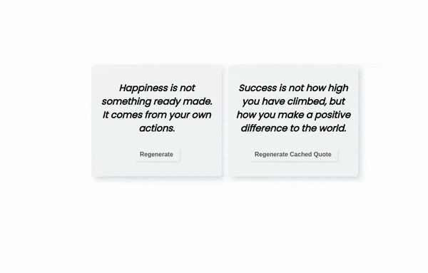
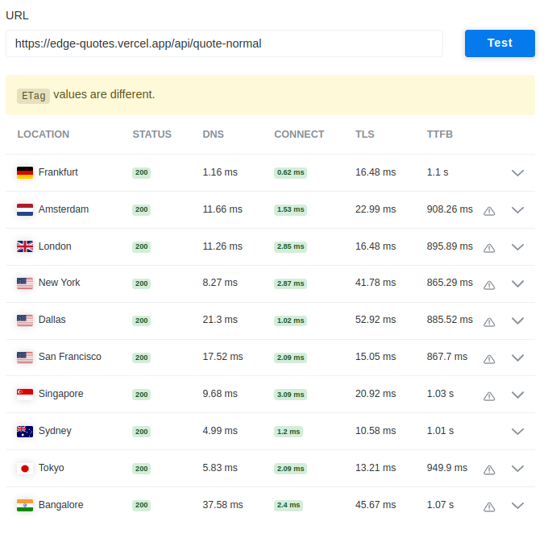
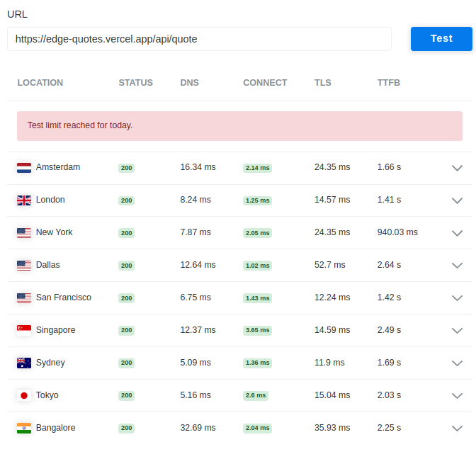
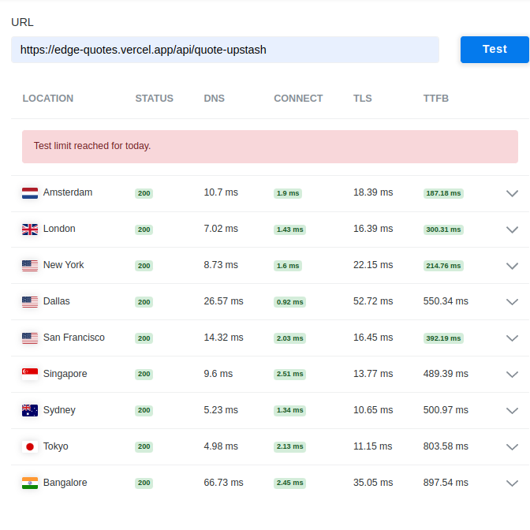

# Welcome to Edge Quotes App

Checkout the [live site here](https://edge-quotes.vercel.app)!


The purpose of this repository is to test out Prisma Data Proxy and use it with NextJs Edge Functions. And then have to routes `/api/quote` and `api/quote-ustash` (return cached data) and benchmark performance differences.

---
## Requirements

- [x] [PostgreSQL with SupaBase](https://supabase.com/)
- [x] [Prisma Data Proxy](https://www.prisma.io/docs/data-platform/data-proxy/use-data-proxy)
- [x] [Upstash with Redis Database](https://upstash.com/)

Check out the example [.env](./env-example) file and fill in the variables

## Getting Started

```shell
yarn
yarn prisma migrate dev
yarn prisma generate --data-proxy
yarn dev 
$ next dev

ready - started server on 0.0.0.0:3000, url: http://localhost:3000
```

---

### Results

We will use Time to First Byte (TTFB) as the key metric here:

1. Normal API - Performed average from *865ms to 1.1s*
2. Edge API - Performed worse from *940ms to 2.64s*
3. Edge API (Cached) - performed the best with all TTFB values ***184ms** to 900ms*

#### Normal API



#### Edge function API



#### Edge function Cached API


